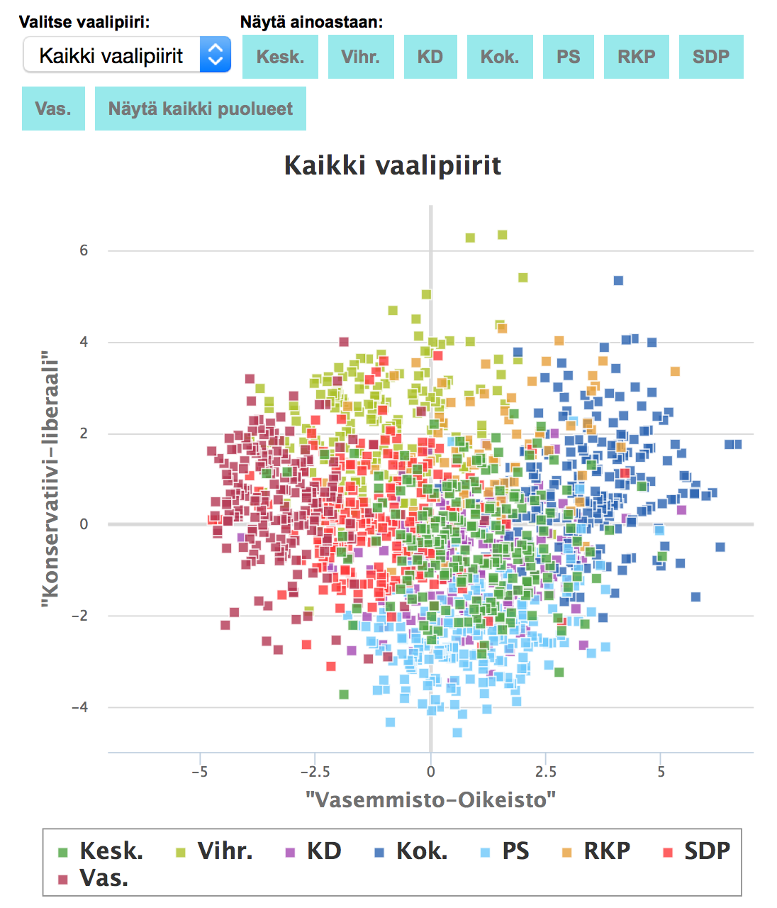
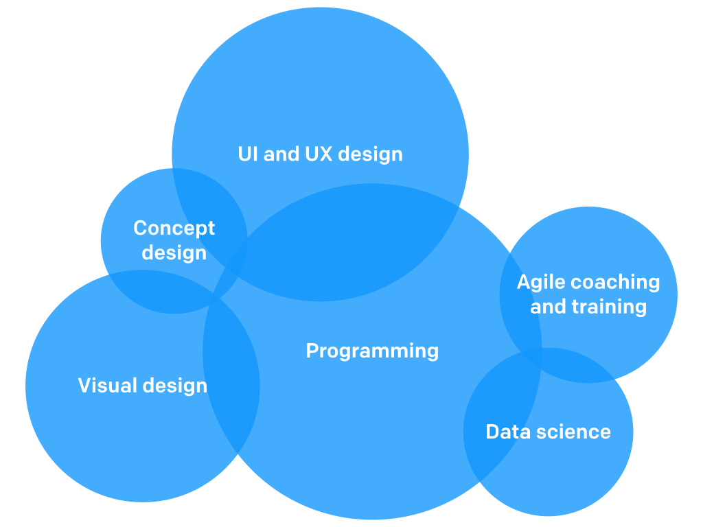
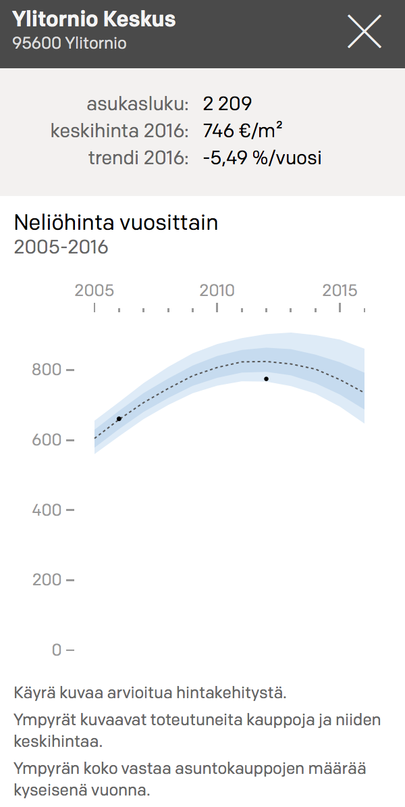
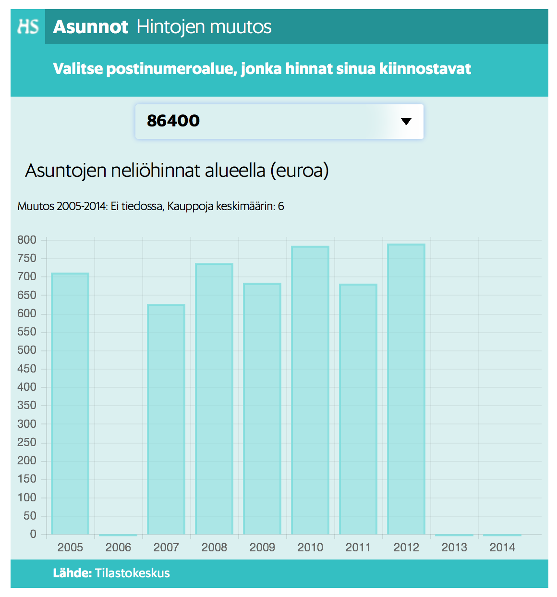

```{r setup, echo=FALSE, results='hide', message=FALSE}
# Load packages
library("dplyr")
library("tidyr")
library("reshape2")
library("ggplot2")
theme_set(theme_bw(base_size = 16))
library("gridExtra")
library("lubridate")
library("gdata")
library("wordcloud")
library("tm")
library("RColorBrewer")
library("corrplot")
library("RCurl")
```


## TODO

* try presentation mode
* try including html frames from Yle and HS
* check slides by others (Aalto)
* parempi otsikko!
* check this. 

* reaktor logo on the first page at least
* Slide sources somewhere, also slideshare link?

<article class="smaller">
* make Source texts small!
</article>

Style

* two columns
* bigger figures (right col, or bg?), include source also

# Part 1: What is data science?

## What do you think?

<center>

</center>

```{r wordcloud, echo=FALSE, message=FALSE}
if (F) {
# Read survey data
source("read_google_spreadsheet.R")
gdoc.url <- "https://docs.google.com/spreadsheets/d/19DWN0n1GBOLRpttgt9oXhObs58XxlXVW7FO72t-82TQ/pubhtml"
temp <- readGoogleSheet(gdoc.url)
survey.res <- cleanGoogleTable(temp, table=1)
# Process
keywords <- survey.res[,3] %>%
  tolower %>%
  gsub(";", ",", x=.) %>%
  strsplit(split=",") %>%
  unlist %>%
  trim %>%
  table
# Make wordcloud
set.seed(123)
wordcloud(words=names(keywords), freq=keywords, scale=c(4,0.7), min.freq = 1,
          random.order=FALSE, random.color=FALSE, rot.per=0.0, 
          use.r.layout=FALSE, colors=brewer.pal(6, "Dark2"), fixed.asp=FALSE)
}
```


## What do others think?

> * "Data Science is statistics on a Mac" [-Big Data Borat on Twitter][borat]

> * "Big data is like teenage sex: everyone talks about it, nobody really knows how to do it, everyone thinks everyone else is doing it, so everyone claims they are doing it..." [-Dan Ariely on Facebook][donairely]

> * "Data science is the process of formulating a quantitative question that can be answered with data, collecting and cleaning the data, analyzing the data, and communicating the answer to the question to a relevant audience."  [-simply stats][simplystats-ds]

[borat]: https://twitter.com/bigdataborat/status/372350993255518208
[donairely]: https://www.facebook.com/dan.ariely/posts/904383595868
[simplystats-ds]: http://simplystatistics.org/2015/03/17/data-science-done-well-looks-easy-and-that-is-a-big-problem-for-data-scientists/

## What do I think?

Important questions:

* Where can data science be applied?
* What is doing data science in practice?
* What does it mean to be data-driven?
* What data science can NOT do?

## Why should you care?

Almost everything can (and will) be quantified and the data will increasingly affect our everyday lives.

Important to understand at least the basics of data, statistics & "algorithms".

Working with data offers a wide range of interesting opportunities!


## Where can data be applied?

* Business
    * Improved (personalised) services
    * Optimised operations
* Quantitative research
    * Natural sciences
    * Also social sciences
* Social good
* Journalism
* Software development (lean / agile)
* Quantified self
* ...

##  Improved (?) personalised services


<center>


</center>


<div class="columns-2">
</div>

<article class="smaller">
* Sources: [stanford2009](http://stanford2009.wikispaces.com/5_Facebook+5.04) and [cantech letter](http://www.cantechletter.com/2013/01/will-predictive-analytics-in-education-widen-the-gap-between-the-arts-and-sciences0128/)
</article>


##

<center>

</center>

Nate Silver predicting the Presidential election results in 2012

<article class="smaller">
* Source: [DataPsych](http://datapsych.weebly.com/blog/mining-silvers-gold-the-basics-behind-nate-silvers-election-prediction-strategies)
</article>

##

<center>

</center>

Using Satellite Images to Understand Poverty

<article class="smaller">
* Source: [DataKind](http://www.datakind.org/blog/using-satellite-images-to-understand-poverty/)
</article>

## 

<center>

</center>

Using big data to prevent homelessness in New York

<article class="smaller">
* Source: [Sumall.org](http://www.sumall.org/homelessness/)
</article>

## 

<iframe title="Yle nelikenttä" height="400" src="http://svenska.yle.fi/dataviz/2015/fyrfalt/nelikentta.html" frameborder="1" allowfullscreen></iframe>

<!-- alternative static figure
<center>

</center>
-->

<article class="smaller">
* Source: [Yle 13.4.2015](http://yle.fi/uutiset/kuka_on_oikeistolaisin_kuka_liberaalein__katso_miten_ehdokkaasi_asettuu_poliittiselle_nelikentalle/7919930)
</article>


# Part 2: Data science at Reaktor

## My journey towards data science

Studies at Aalto (former Helsinki University of Technology)

* Statistical machine learning and bioinformatics
* Dissertation: [Probabilistic components of molecular interactions and drug responses][dissertation]

Data scientist at Reaktor

Open tools for open data: [Louhos] & [rOpenGov]

Interests: probabilistic (Bayesian) modeling, information visualization, open source/data/science

I like: solving hard problems in various fields, learning and sharing

[dissertation]: https://aaltodoc.aalto.fi/handle/123456789/13631
[Louhos]: http://louhos.github.io/
[rOpenGov]: http://ropengov.github.io/

## Reaktor

<center>

</center>

## Case bikings

FIXME: more figures + add link to material

```{r bike1, echo=FALSE}
# Preparation:
# * clone this repo: https://github.com/apoikola/fillarilaskennat
# * run source/plot_model.R
# * save your workspace as an image with 'save_image()'

# Load image
if (F) {
load("data/bikemodel_plots.RData")

ggplot(bike.dat, aes(x=Day, y=Count, colour=WeekEnd)) + 
  geom_point(size=1) + facet_grid(Year ~ LocationName) + 
  labs(y="Määrä", x="Päivä", colour="Viikonloppu") +
  scale_y_log10() + 
  theme(legend.position="top")
}
```


## Case elections

Read more from [Louhos blog!](http://louhos.github.io/news/2015/04/17/vaalit2015-luokittelu/)

FIXME: more figures + add link to material

```{r elections1, echo=FALSE}
if (F) {
# Download data first from https://github.com/louhos/takomo/tree/master/vaalit2015/luokittelu
load("data/yledata.RData")
load("data/yle.RData")

# Setup party colouring
puolue<-c("IP","KD","KESK","KOK","KTP","M11","PIR","PS","PSYL","RKP","SDP","SKP","STP","VAS","VIHR")
puolue.vari=c(brewer.pal(name="Paired",n=12),"black","gray40","brown")[
  c(1,10,3,2,5,14,13,9,12,11,6,15,7,8,4)]
names(puolue.vari)<-puolue

p<-table(posterior$puolue,posterior$puolue.e)
p.miss<-setdiff(rownames(p),toupper(colnames(p)))
d.p<-dim(p)
p<-cbind(p,matrix(0,d.p[1],length(p.miss))); colnames(p)[(d.p[2]+1):d.p[1]]<-tolower(p.miss)

p<-p[order(rownames(p)),]
p<-p[match(colnames(p),tolower(rownames(p))),]

corrplot(prop.table(p,1),method="shade",is.corr=FALSE,addCoef.col=2,
         addCoefasPercent=TRUE,col=colorRampPalette(c("white","white","black"),1)(80))
}
```

## Data science vs. data journalism?

<div class="columns-2">

<iframe title="HS asuntohinnat" height="250" src="http://dynamic.hs.fi/2015/asuntohinnat_postinumero/" frameborder="1" allowfullscreen></iframe>

<article class="smaller">
* Source: [HS 11.4.2015](http://www.hs.fi/talous/a1428643622153)
</article>

<center>

</center>

<article class="smaller">
* Source: Coming soon by Reaktor!
</article>

</div>

<!-- alternative screenshot
<center>

</center>
-->


## Reaktor data science

Statistical modeling

* dealing with noisy and missing data
* taking uncertainty into account
* predicting future events

Open source tools

Consulting!

# Part 3: Data science in practice

## 

FIXME: add photos: ifhackathon, taulu

## Data science uses cases

<center>

</center>

## Data science skills

FIXME! think about adding Venn diagram from Conway first, maybe also this: http://policyviz.com/communicating-research-build-a-unicorn-dont-look-for-one/

individual vs. team!

## 

<center>

</center>

<article class="smaller">
[Source][marketingdistillery]
</article>

[marketingdistillery]: http://www.marketingdistillery.com/2014/11/29/is-data-science-a-buzzword-modern-data-scientist-defined/

## Data science process

From [Data science done well looks easy][simplystats-easy]

1. Define the question of interest
1. Get the data
1. Clean the data
1. Explore the data
1. Fit statistical models
1. Communicate the results
1. Make your analysis reproducible
1. (Iterate!)

"Yet far too much handcrafted work — what data scientists call “data wrangling,” “data munging” and “data janitor work” — is still required. Data scientists, according to interviews and expert estimates, spend from 50 percent to 80 percent of their time mired in this more mundane labor of collecting and preparing unruly digital data, before it can be explored for useful nuggets." - [Source][nyt-ds80]

FIXME: fillaridata example

[nyt-ds80]: http://www.nytimes.com/2014/08/18/technology/for-big-data-scientists-hurdle-to-insights-is-janitor-work.html
[simplystats-easy]: http://simplystatistics.org/2015/03/17/data-science-done-well-looks-easy-and-that-is-a-big-problem-for-data-scientists/

## Open data science: tools

Open source tools are replacing commercial ones in many DS tasks

* Statistics & computation: R, Python
* Databases: SQL, noSQL (e.g. MongoDB)
* Big data: Hadoop, Spark
* Visualization: ggplot2 (R), matplotlib (Python), d3, Leaflet
* Web stuff: shiny (R)
* Version control: git
* (Excel)
* More: [landscape of open source tools for data science]

[ds-oss-tools]: http://deanmalmgren.github.io/open-source-data-science/

## Open data science: data

Open data sets offer excellent playground for learning new stuff

* Scientific data: rOpenSci
* Government data: rOpenGov
* FIXME: find more
* More: [Datasets for Data Mining and Data Science][kdnug-datasets]

[kdnug-datasets]: http://www.kdnuggets.com/datasets/index.html

## Open data science: analyses

Make your analyses transparent and reproducible! PDF report is not that!

* [No one reads PDF reports!][wordlbank-pdf]
* [Case 'energia-excel'][ts-energiaexcel]
* [Reinhart & Rogoff & austerity][rr-austerity]

Reproducible R scripts

* rmarkdown
* knitr
* See the [source][slides-source] for this slide set!

Check also iPython notebooks!

[ts-energiaexcel]: http://www.taloussanomat.fi/energia/2014/02/14/taloussanomilta-kho-valitus-energia-excel-paatoksesta/20142233/12
[rr-austerity]: http://www.newyorker.com/news/john-cassidy/the-reinhart-and-rogoff-controversy-a-summing-up
[wordlbank-pdf]: http://www.washingtonpost.com/blogs/wonkblog/wp/2014/05/08/the-solutions-to-all-our-problems-may-be-buried-in-pdfs-that-nobody-reads/
[slides-source]: FIXME -ADD


# Part 4: Data-driven culture

## What is important in the data science process?

> * product
> * < statistical methods
> * < data access & munging
> * < business case
> * < getting to production

FIXME: fix these

> Modified from [Louhia's blog post][louhia-analytics]

> Is this all?

[louhia-analytics]: http://www.louhia.fi/2015/01/25/ja-maailman-paras-analytiikkasofta/

## It's not always complicated!

<center>

</center>

Hans Rosling communicating facts about the world

Source: [Everything is Naked](http://everythingisnaked.com/gap-minder-the-beauty-of-visualized-statistics/)


## Ideals of being data-driven

* be **curious** (seek for evidence)
* be **active** (test, don’t just observe and analyse)
* be **Bayesian** (understand uncertainties)
* be **courageous** (act on the evidence)
* be **agile** (learn, fail fast… but not too fast: collect enough evidence)
* be **transparent** and **helpful** (show and share information, co-operate)
* be **truthful** and **non-political** (don’t abuse data, work across silos)
* be **wise** (there is a time to be data-driven and a time to be intuitive)

"Culture eats strategy for breakfast"  
(attributed to P. Drucker, popularised by M. Fields)

## Experimentation & evidence-based decision making

* Empirism
* A/B testing
* Lean startup
* Agile development
* Sami Honkonen's quote: "One experiment is better than a thousand meetings"
* Evidence-based medicine

# Part 5: Is data almighty?

## Hype

<center>

</center>


Source: [Gartner][gartner-hypecurve]

[gartner-hypecurve]: http://www.gartner.com/newsroom/id/2819918

## Causality vs. correlation


Source: [Tylergive](http://tylervigen.com/)

## Problems with Big Data?

Big data is 

* **O**bservational: much of the new data come from sensors or tracking devices that monitor continuously and indiscriminately without design, as opposed to questionnaires, interviews, or experiments with purposeful design
* Lacking **C**ontrols: controls are typically unavailable, making valid comparisons and analysis more difficult
* Seemingly **C**omplete: the availability of data for most measurable units and the sheer volume of data generated is unprecedented, but more data creates more false leads and blind alleys, complicating the search for meaningful, predictable structure
* **A**dapted: third parties collect the data, often for a purposes unrelated to the data scientists’, presenting challenges of interpretation
* **M**erged: different datasets are combined, exacerbating the problems relating to lack of definition and misaligned objectives

Source: [Kaiser Fung on HBR][occam]

[occam]: https://hbr.org/2014/03/google-flu-trends-failure-shows-good-data-big-data/

* Big data hype stuff: "The end of theory", others?


## What can go wrong?

* stats: http://www.analyticbridge.com/profiles/blogs/statistical-thinking-is-not-science-fiction-but-a-necessity
* sudenkuopat by Louhia
* p-values (Gelman stuff), crisis in science
* understanding uncertainty & probabilities (Kahneman, biases)
* many things can not be predicted (Black Swan)

## Some future trends

* Digitalization
* Openness
* Algorithms
* Mydata vs. bigdata
* FIXME more or remove

## Conclusions


Repeat why should I care!

* amount of data does not matter, more important is where the data comes from (OCCAM)
* Data can help in many ways
* Data-driven culture is the key
* Testing/experimentation
* Understand numbers and statistics


## Extra

* Resources: Blog and send? list in the end, blog more!
* Try & share & discuss
* Community: Hki DS + Meetup, Tre?, #r-project
* Your background: network of paired words
* Uncertainty vs. risk: * Kahneman, biases
* Learning the basics: http://www.sharpsightlabs.com/start-with-data-visualization-manipulation/
* There's more, e.g. [here](http://blog.dominodatalab.com/10-interesting-uses-of-data-science/), but we do not hear about the best business cases...

* include some funny stuff from Kippt-fun, e.g. xkcd, dilbert?


## Extra

<iframe title="YouTube video player" width="480" height="390" src="http://www.youtube.com/watch?v=wV0Ks7aS7YI??autoplay=1?html5=1" frameborder="0" allowfullscreen></iframe>
