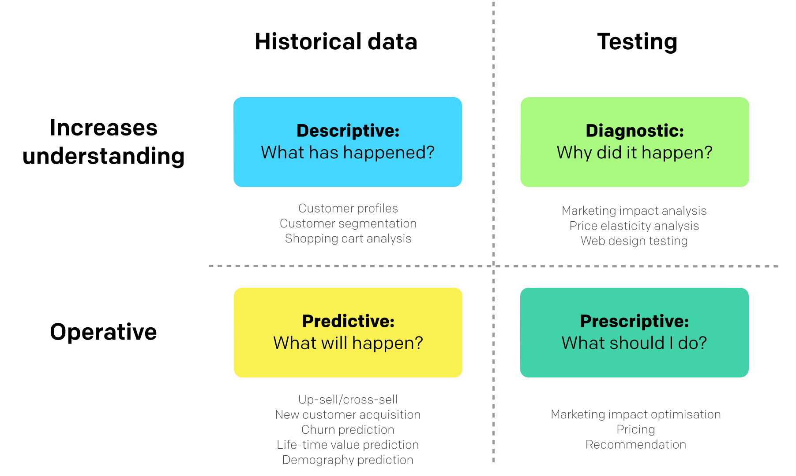

## TODO

* Survey: long https://docs.google.com/forms/d/1qsELfWohq0JKWV2w72Th026zzNcIhpdKbDnOevY9Frs/viewform
* and short: http://goo.gl/forms/5mUOc6wafr

Style

* two columns
* bigger figures (right col, or bg?), include source also
* reaktor logo 
* include some funny stuff from Kippt-fun, e.g. xkcd, dilbert?

Slide sources somewhere, also slideshare link?

# Part 1: What is data science

## What do you think?

FIXME: Audience view: word puzzle from responses

## What do others think?

"Data Science is statistics on a Mac"  
[-Big Data Borat on Twitter][borat]

"Big data is like teenage sex: everyone talks about it, nobody really knows how to do it, everyone thinks everyone else is doing it, so everyone claims they are doing it..."  
[-Dan Ariely on Facebook][donairely]

"Data science is the process of formulating a quantitative question that can be answered with data, collecting and cleaning the data, analyzing the data, and communicating the answer to the question to a relevant audience."  
[-simply stats][simplystats-ds]

[borat]: https://twitter.com/bigdataborat/status/372350993255518208
[donairely]: https://www.facebook.com/dan.ariely/posts/904383595868
[simplystats-ds]: http://simplystatistics.org/2015/03/17/data-science-done-well-looks-easy-and-that-is-a-big-problem-for-data-scientists/

## Questions today

* Where can data science be applied?
* What is data science in practice?
* What is data-driven culture?
* What data can not do?

## Where can data be applied

* Research
    * Traditional natural sciences
    * More and more also in social sciences
* Business
    * Optimising operations
    * Improved services
* Journalism
* Software development (lean / agile)
* Personal life: Quantified self
* Social good

## Data science in business

* Amazon
* Netflix

## Social data science

* Nate Silver
* Hans Rosling

## Data journalism

* Yle: Teemo
* HS: Esa

## Data4good

* Dataking: village roof stuff
* Sumall.org: NYC eviction prediction

## Other data-driven things

* Agile
* Lean

# Part 2: Data science at Reaktor

## My background

Studies

* MSc: Bioinformation technology at HUT
* PhD: Bioinformatics at Aalto

Open stuff

Reaktor

Sum of some vague general direction + a lot of chances/coincidences

## Reaktor Data Science

## Biking and weather

## Election: party prediction

## Data science vs. data journalism?

* House prices from HS vs. Reaktor

# Part 3: Data science in practice

## 

FIXME: add photos: ifhackathon, taulu

## Data science uses cases

## Data science skills

FIXME! think about adding Venn diagram first

[Source][marketingdistillery]

[marketingdistillery]: http://www.marketingdistillery.com/2014/11/29/is-data-science-a-buzzword-modern-data-scientist-defined/

## Data science process

From [Data science done well looks easy][simplystats-easy]

1. Define the question of interest
1. Get the data
1. Clean the data
1. Explore the data
1. Fit statistical models
1. Communicate the results
1. Make your analysis reproducible
1. (Iterate!)

"Yet far too much handcrafted work — what data scientists call “data wrangling,” “data munging” and “data janitor work” — is still required. Data scientists, according to interviews and expert estimates, spend from 50 percent to 80 percent of their time mired in this more mundane labor of collecting and preparing unruly digital data, before it can be explored for useful nuggets." - [Source][nyt-ds80]

FIXME: fillaridata example

[nyt-ds80]: http://www.nytimes.com/2014/08/18/technology/for-big-data-scientists-hurdle-to-insights-is-janitor-work.html
[simplystats-easy]: http://simplystatistics.org/2015/03/17/data-science-done-well-looks-easy-and-that-is-a-big-problem-for-data-scientists/

## Open data science: tools

Open source tools are replacing commercial ones in many DS tasks

* Statistics & computation: R, Python
* Databases: SQL, noSQL (e.g. MongoDB)
* Big data: Hadoop, Spark
* Visualization: ggplot2 (R), matplotlib (Python), d3, Leaflet
* Web stuff: shiny (R)
* Version control: git
* (Excel)
* More: [landscape of open source tools for data science]

[ds-oss-tools]: http://deanmalmgren.github.io/open-source-data-science/

## Open data science: data

Open data sets offer excellent playground for learning new stuff

* Scientific data: rOpenSci
* Government data: rOpenGov
* FIXME: find more
* More: [Datasets for Data Mining and Data Science][kdnug-datasets]

[kdnug-datasets]: http://www.kdnuggets.com/datasets/index.html

## Open data science: analyses

Make your analyses transparent and reproducible! PDF report is not that!

* [No one reads PDF reports!][wordlbank-pdf]
* [Case 'energia-excel'][ts-energiaexcel]
* [Reinhart & Rogoff & austerity][rr-austerity]

Reproducible R scripts

* rmarkdown
* knitr
* See the [source][slides-source] for this slide set!

Check also iPython notebooks!

[ts-energiaexcel]: http://www.taloussanomat.fi/energia/2014/02/14/taloussanomilta-kho-valitus-energia-excel-paatoksesta/20142233/12
[rr-austerity]: http://www.newyorker.com/news/john-cassidy/the-reinhart-and-rogoff-controversy-a-summing-up
[wordlbank-pdf]: http://www.washingtonpost.com/blogs/wonkblog/wp/2014/05/08/the-solutions-to-all-our-problems-may-be-buried-in-pdfs-that-nobody-reads/
[slides-source]: FIXME -ADD

# Part 4: Data-driven culture

## What is important in the data science process?

> * product
> * < statistical methods
> * < data access & munging
> * < business case
> * < getting to production

FIXME: fix these

> Modified from [Louhia's blog post][louhia-analytics]

> Is this all?

[louhia-analytics]: http://www.louhia.fi/2015/01/25/ja-maailman-paras-analytiikkasofta/

## Ideals of being data-driven

* be **curious** (seek for evidence)
* be **active** (test, don’t just observe and analyse)
* be **Bayesian** (understand uncertainties)
* be **courageous** (act on the evidence)
* be **agile** (learn, fail fast… but not too fast: collect enough evidence)
* be **transparent** and **helpful** (show and share information, co-operate)
* be **truthful** and **non-political** (don’t abuse data, work across silos)
* be **wise** (there is a time to be data-driven and a time to be intuitive)

"Culture eats strategy for breakfast"  
(attributed to P. Drucker, popularised by M. Fields)

## Experimentation & evidence-based decision making

* Lean startup
* Agile development
* Sami Honkonen's quote: "One experiment is better than a thousand meetings"
* Evidence-based medicine

# Part 5: Is data almighty?

## Hype

Source: [Gartner][gartner-hypecurve]

[gartner-hypecurve]: http://www.gartner.com/newsroom/id/2819918

## Causality vs. correlation

Source: [Tylergive](http://tylervigen.com/)

## Problems with Big Data?

Big data is 

* **O**bservational: much of the new data come from sensors or tracking devices that monitor continuously and indiscriminately without design, as opposed to questionnaires, interviews, or experiments with purposeful design
* Lacking **C**ontrols: controls are typically unavailable, making valid comparisons and analysis more difficult
* Seemingly **C**omplete: the availability of data for most measurable units and the sheer volume of data generated is unprecedented, but more data creates more false leads and blind alleys, complicating the search for meaningful, predictable structure
* **A**dapted: third parties collect the data, often for a purposes unrelated to the data scientists’, presenting challenges of interpretation
* **M**erged: different datasets are combined, exacerbating the problems relating to lack of definition and misaligned objectives

Source: [Kaiser Fung on HBR][occam]

[occam]: https://hbr.org/2014/03/google-flu-trends-failure-shows-good-data-big-data/

* Big data hype stuff: "The end of theory", others?

## What can go wrong?

* sudenkuopat by Louhia
* 

## Some future trends

* Digitalization
* Openness
* Algorithms
* Mydata vs. bigdata
* FIXME more or remove

## Conclusions

* Data can help in many ways
* Data-driven culture is the key
* Testing/experimentation
* Understand numbers and statistics

## Extra

* Resources: Blog and send? list in the end, blog more!
* Try & share & discuss
* Community: Hki DS + Meetup, Tre?, #r-project
* Your background: network of paired words
* Uncertainty vs. risk: * Kahneman, biases
